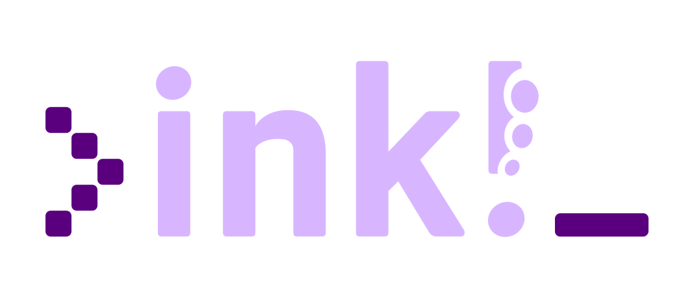

    

[![CI Status][a1]][a2]
[![Matrix Chat][b1]][b2]
[![Discord Chat][c1]][c2]
[![Latest Release][d1]][d2]

[a1]: https://gitlab.parity.io/parity/cargo-contract/badges/master/pipeline.svg
[a2]: https://gitlab.parity.io/parity/cargo-contract/pipelines
[b1]: https://img.shields.io/badge/matrix-chat-brightgreen.svg?style=flat
[b2]: https://riot.im/app/#/room/#ink:matrix.parity.io
[c1]: https://img.shields.io/discord/722223075629727774?style=flat-square&label=discord
[c2]: https://discord.gg/ztCASQE
[d1]: https://img.shields.io/crates/v/cargo-contract.svg
[d2]: https://crates.io/crates/cargo-contract

> `cargo-contract` is a CLI tool which helps you develop smart contracts in Parity's <a href="https://github.com/paritytech/ink">ink!</a>. ink! is a Rust [eDSL](https://wiki.haskell.org/Embedded_domain_specific_language) which allows you to write smart contracts for blockchains built on the [Substrate](https://github.com/paritytech/substrate) framework.

 

[Guided Tutorial for Beginners](https://substrate.dev/substrate-contracts-workshop/#/0/building-your-contract)&nbsp;&nbsp;•&nbsp;&nbsp; 
[ink! Documentation Portal](https://paritytech.github.io/ink-docs)

 

More relevant links:
* Talk to us on [Element][b2] or [Discord][c2]
* [`ink!`](https://github.com/paritytech/ink) ‒ The main ink! repository with smart contract examples
* [Canvas UI](https://paritytech.github.io/canvas-ui/#/upload) ‒ Frontend for contract deployment and interaction
* [Canvas Node](https://github.com/paritytech/canvas-node) ‒ Simple Substrate blockchain which includes smart contract functionality

## Installation

* Step 1: `rustup component add rust-src`.

* Step 2: Install `binaryen` in a version >= 99:

  * [Debian/Ubuntu](https://tracker.debian.org/pkg/binaryen): `apt-get install binaryen`
  * [Homebrew](https://formulae.brew.sh/formula/binaryen): `brew install binaryen`
  * [Arch Linux](https://archlinux.org/packages/community/x86_64/binaryen/): `pacman -S binaryen`
  * Windows: [binary releases are available](https://github.com/WebAssembly/binaryen/releases)

  There's only an old version in your distributions package manager? Just use a 
  [binary release](https://github.com/WebAssembly/binaryen/releases).

* Step 3: `cargo install --force cargo-contract`

### Docker Image
If you'd prefer to use Docker instead we have a Docker image [available on the Docker Hub](https://hub.docker.com/r/paritytech/contracts-ci-linux)
which contains the dependencies needed to build `cargo-contract`, as well as
`cargo-contract` itself. 

## Usage

You can always use `cargo contract help` to print information on available
commands and their usage.

For each command there is also a `--help` flag with info on additional parameters,
e.g. `cargo contract new --help`.

##### `cargo contract new my_contract`

Creates an initial smart contract with some scaffolding code into a new
folder `my_contract` .

The contract contains the source code for the [`Flipper`](https://github.com/paritytech/ink/blob/master/examples/flipper/lib.rs) 
contract, which is about the simplest "smart" contract you can build ‒ a `bool` which gets flipped
from `true` to `false` through the `flip()` function.

##### `cargo +nightly contract build`

Compiles the contract into optimized WebAssembly bytecode, generates metadata for it,
and bundles both together in a `<name>.contract` file, which you can use for
deploying the contract on-chain.

`cargo contract build` must be run using the `nightly` toolchain. If you have
[`rustup`](https://github.com/rust-lang/rustup) installed, the simplest way to
do so is `cargo +nightly contract build`.

To avoid having to always add `+nightly` you can also set `nightly` as the default
toolchain of a directory by executing `rustup override set nightly` in it.

##### `cargo contract check`

Checks that the code builds as WebAssembly. This command does not output any `<name>.contract`
artifact to the `target/` directory.

##### `cargo contract test`

Runs test suites defined for a smart contract off-chain.

## License

The entire code within this repository is licensed under the [GPLv3](LICENSE).

Please [contact us](https://www.parity.io/contact/) if you have questions about
the licensing of our products.

